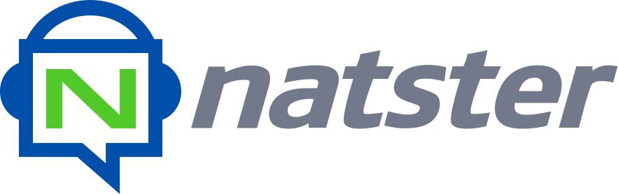

## _Connect your media_
Natster leverages [Synadia Cloud](https://cloud.synadia.com)’s global reach and NATS connectivity to create a secure, peer-to-multipeer media sharing ecosystem: all without uploading anything to the cloud or opening a single firewall port. Core pieces of the Natster application wouldn't be possible w/out NATS, and aspects of this architecture saved us weeks, if not months, of development time simply by leveraging features that come with NATS out of the box.

Many media sharing applications require you to upload your files to their servers, and you have to take their word for it that they won't peek at your files. Natster shows how to build applications where your data stays with you, and is never stored centrally. When you exchange media with a friend, it's done directly across a secure import, and it's encrypted with single-use keys that Synadia can't see.

Natster isn't just a media sharing application, it's an example of how to build modern, distributed, secure, decentralized applications using _nothing but NATS_.

# Natster Features
The following is a list of the features that make Natster both powerful and unique:

* Define and manage media catalogs - Scan through a directory and turn it into a media catalog
* Serve a media catalog - Run a Natster process that securely hosts your media catalog
* Share catalogs with friends - Securely share your catalog with another Synadia Cloud/Natster user, all built atop NATS's secure account import/export system and the Synadia Cloud API.
* View catalog contents - View the contents of your friends' catalogs, but only while their catalog is online
* Download files - See how we can use one-time **Xkeys** to encrypt data downloads so no one, not even Synadia, can see the contents
* Store nothing - Nothing is stored in the cloud except a bit of metadata to facilitate logins. Your data is private and this app shows development patterns on how to keep it that way.
* [Natster.io](https://natster.io) - A secure website where you can interact with your catalogs and those shared with you, even if you're nowhere near the catalog servers
* Global Service - We host a service in a well-known account that is available to everyone with a Synadia Cloud account, running on top of [nex](https://github.com/synadia-io/nex). We don't need to worry about setting up, deploying, and securing a RESTful API. With Synadia Cloud/NATS, we can just export a service and we get security and availability for free.
* Natster Hub - We host a catalog pre-filled with useful videos and informative content on NATS, Natster, and Nex. We didn't need to do anything special to make this happen, the hub is just another Synadia Cloud account running a secure catalog server.

More documentation will be forthcoming.
