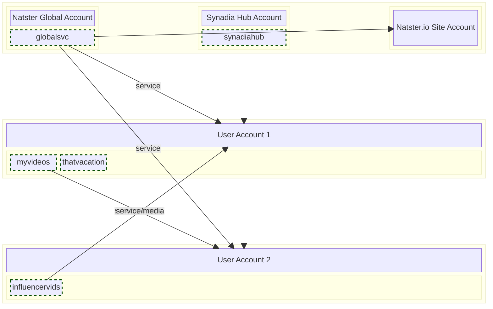



The Natster architecture relies heavily on NATS decentralized accounts as security boundaries. Each user enables Natster within their Synadia Cloud account. This creates a few automatic subject [imports](https://docs.nats.io/running-a-nats-service/configuration/securing_nats/accounts#exporting-and-importing) for things like the `synadiahub` catalog and the Natster global service.

The following diagram provides a layout showing how various components interact with each other. Below that there is an in-depth explanation of each component.

## Natster Global Account
The Natster global account is just a regular Synadia Hub account. It has no special privileges and doesn't hold a position of any importance within Synadia. It is literally just an account we created within a Synadia Cloud team. That's right: the key lynchpin to this application is running inside an unprivileged account. This means that any application _you_ want to build on top of NATS and Synadia Cloud can work the same way. 

The Natster global account has the following imports and exports:
* `natster_global` - A service export on the subject `*.natster.global.>`
* `global_events` - A feed export on the subject `*.natster.global-events.*`

We've split the subjects up into two logical roles. The `natster_global` export exposes a service so that clients can make NATS requests. The `global_events` export is a feed designed for users to subscribe to. There's no impact on whether you do or don't subscribe to this. The Natster.IO website uses this to help keep the interface up to date in real-time.

### The Natster Global Service
The [Natster global service](../global-service) is just a Go binary that is running inside [nex](https://github.com/synadia-io/nex)[^1]. It awaits requests on a well-known set of subjects forming the global service API. 

The global service does not manage any of your sensitive information other than holding onto the last personal access token you used so that it can make Synadia Cloud API requests on your behalf. We don't want any personal information and nearly everything stored are just reference keys and statistics to power our dashboard.

Your catalog contents are never queried, stored, or cached by this service.

## Synadia Hub Account
Just like the global service account, the Synadia Hub account is a completely unprivileged user account with no special abilities or security clearances. It is an account just like one you could create for your applications that you build on NATS.

Inside this account there is a NATS user. Running in our cloud infrastructure is a [catalog service](../catalog-server) serving the synadia hub catalog. This catalog is just like anyone else's catalog, except that we have a bunch of interesting content in this catalog about NATS and Synadia Cloud.

It has the usual exports for a user account:

* `natster_catalog` - A single export used by all sharing clients
* `natster_media` - A stream on which encrypted and chunked data is published to valid consumers

## Natster.IO Account
What's interesting about the Natster.IO website is that it communicates with NGS and Synadia Cloud as _you_. Just like all our other components, the Natster website has no special privileges[^2]. When you log into the website, it pulls your Natster context from a previous [context binding](../context-binding) and uses that to log in. 

The website is then really just a fancy version of your CLI, but it's running on a public endpoint, accessible anywhere, without compromising security or performance. Natster.IO subscribes to the `natster.global-events.*` and `natster.local-events.*` subjects to keep the user interface updated in realtime.

## User Accounts
As we've mentioned, all of Natster is made up of user accounts. Aside from the well-known accounts like Synadia Hub and Natster Global, every user can configure an account to use Natster by running the `init` command from the Natster CLI.

These accounts are unprivileged within NGS and can securely share and consume services from other NGS accounts without requiring central facilitation.

### User Catalog Imports/Exports
When a user runs `natster catalog serve` on one of their local catalogs, it starts a service that utilizes 2 exports total, as well as 2 imports _per imported media catalog_.[^3]

* `natster_catalog` - A single export used by all sharing clients
* `natster_media` - A stream on which encrypted and chunked data is published to valid consumers
* `natster_{catalog}` - A service-type import used for communicating _directly_ with a shared catalog
* `natster_{catalog}_media` - A stream-type import used for capturing encrypted chunks of data requested via the catalog service.

---
[^1]: As we experiment and expand and contract the infrastructure, we may change the ratio of nex-hosted to non-nex-hosted global service instances. Our design makes this detail irrelevant to clients.

[^2]: There is a function on the global service it can call that no one else can, but that's enforced by the global service, and not NATS

[^3]: Keep an eye on your imports because they affect your team's quota