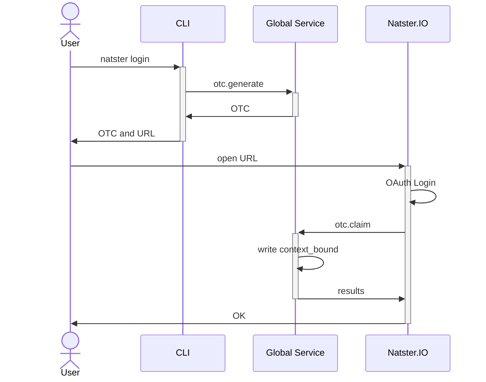

The core job of _context binding_ is to merge the two contexts or mediums together to provide a single unified experience: web and CLI. When you log into our web application, you do so via [OAuth](https://oauth.net/2/). This means the website gets no information that you don't allow, and is usually just an opaque unique identifier issued by an identity provider.

## Natster Init
Natster init takes your Synadia Cloud context, indicated by your **personal access token**. As discussed in [getting started](../../usage/getting-started), you can generate a new personal access token by using the Synadia Cloud web application. Be careful with these, because Synadia Cloud will only ever show you the code _once_.

After you have successfully run `natster init`, the Natster CLI will establish a local context for you that includes a number of pieces of information:

* Synadia Team ID
* Synadia Account ID (different than public key)
* Synadia Account Public Key
* Synadia User ID
* User credentials to log into NGS

For your own exploration, after you've run `init`, take a look at the `*.context` file(s) in your `~/.natster` directory. They're JSON files that contain all the necessary information to perform Natster CLI tasks.

What's missing here is a link to your web identity.

## Web Login
Logging into [natster.io](https://natster.io) involves a few redirects between the site and an OAuth identity provider. When communicating with the IDP (identity provider), you'll either log in using your Google account or your Github account. Both of these are OAuth-friendly identities.

After you've gone through the initial redirect process to verify your Github or Google identity, you'll be taken back to the website. At this point, you won't see anything other than the CLI instructions, because the website has no idea what Natster context applies to your web identity.

To create that link, we'll need to use one-time codes.

## Binding Contexts with One-Time Codes
The following sequence diagram illustrates the flow where a user binds their existing Natster context to a web identity. Note that this flow can only take place _after_ a user runs `natster init`.

The user will type `natster login` within an already initialized Natster context. This will ask the global service to generate a new one-time code. This one-time code is stored in a key-value bucket configured with a short time-to-live (TTL). The data corresponding to the key is the Natster context information, such as the Synadia team, account, and user IDs.

Users will only have a limited time (the bucket's TTL) to claim this code.

The CLI will then display a URL containing the newly generated code (and open it automatically if possible). The user then follows this URL (Natster can even render a QR code in the terminal!) to the website, where they will go through the OAuth flow to establish their identity.

With both the Natster context _and_ a web identity in hand, the global service can write a `context_bound` [event](../global-event-log) to the log. With that event in the log, all related projections will now be able to match both web and CLI identities to the same context.
