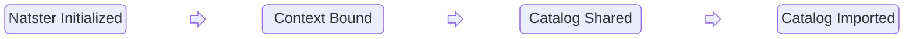

Some portions of the Natster application are what we would call _event-sourced_. Since the entire application doesn't operate this way (because of time constraints as we worked toward a Kubecon demo release), we'll call it _event-sourcey_.

The short[^1] definition of event sourced is that rather than managing an application's state by storing the current values of everything, we instead _derive_ that state from a series of immutable events. We want to know _why_ and _how_ we arrived at a given state and, even more importantly, we want to be able to change the state we store without altering our record of the past.

JetStream streams (especially in high availability persistence mode) are ideal for use in event sourcing, and hopefully one day there may even be a book showing how to build event-sourced applications with [nothing but NATS](../nothing-but-nats).[^2]

Event sourcing requires that we model the core truth of our application as a sequence of events that occur in the past, in time order. For example, the following is a pretty standard sequence of Natster events:

When we query an account's projection (aka _materialized view_), then we'll see when the account was initialized, when the context was bound (and the details of that binding). We are also able to get the list of "known catalogs": the combination of catalogs shared _with_ a user and _by_ a user.

The event sequence above is the only truth that matters. In an event sourced system, we can destroy all of the projections because we can simply rebuild them. In our case, to rebuild our projections, we simply delete the projections (entries in key-value buckets) and the consumers (each projector gets a consumer, but that's a detailed topic for another medium) and then when the global service starts up, all the projections are recreated.

It's a topic for an entire book, but it can't be overstated how powerful it is that we can regenerate derived state on demand. This means we can _test_ the entire system to ensure it's deriving the right state, and we can evolve our projectors over time to store more data or even change the shape of stored data.


The data stored in individual events is encrypted at rest. All data is inside a regular NGS account and not in Synadia-specific infrastructure. Additionally, we avoid storing anything that could provide any hint as to the contents of any catalog. The main reason we keep a central record of catalog shares (which only contain catalog IDs and account public keys) is so we can proactively warn people about potential duplicate catalog names and to get a list of candidates to potentially win prizes. 💰 


[^1]: We know there are purity gaps in our implementation and even the definition used here
[^2]: This is not a guarantee, but hopeful thinking.