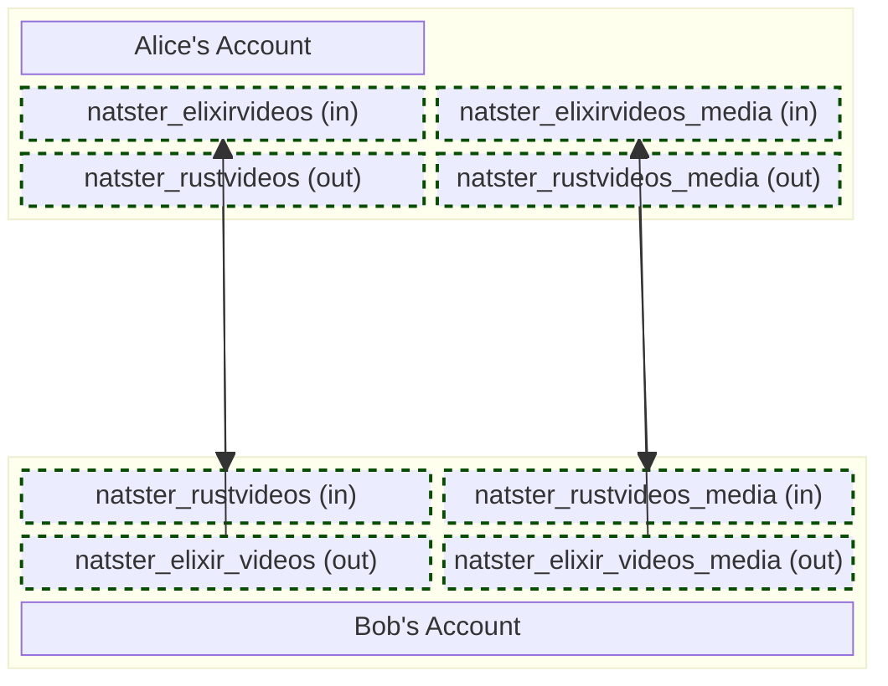

In this section of the documentation, we'll cover how Natster enables incredibly tight security around sharing without having to write much security code at all. The NATS import/export system that comes with decentralized authentication and accounts does all the hard work for us.

Let's take a look at a simple example of how two users might share with each other using Natster. Alice has a catalog full of Rust videos that she would like to share with Bob. On the other hand, Bob has a catalog full of Elixir videos that he would like to share with Alice.

In this scenario, Alice will share her `rustvideos` catalog with Bob, and Bob will share his `elixirvideos` catalog with Alice. This results in both Alice and Bob adding 2 new imports each while they reuse their pre-existing exports for both catalog services and media.

## One-Way Sharing

Depending on how Mermaid renders the above diagram, it might be a little difficult to see where the arrows are. There is a one-way _export_ from Alice to Bob containing her Rust videos and there is a one-way _export_ from Bob to Alice containing his Elixir videos. No other Synadia Cloud user is aware of this share nor can they leverage it in any way to gain access to the catalog contents or the media contained within.

## Account Token Positions
With all of this importing and exporting going on, how do we ensure that Alice and Bob can both securely share their information and also make sure that no other NGS user, no matter how clever, can impersonate either Bob or Alice to get at private media?

This is where one of NATS most underrated and powerful features comes in, account token positions. It also doesn't appear much in the main documentation, which could be improved. The way an account token position works is that we can use the _subject mapping_ feature of imports to enforce that no one else in the universe can create an import with the same subject.

### Imports with Account Tokens
Let's take a look at Bob's import, where he's importing the `rustvideos` catalog from Alice. For the sake of brevity, we'll assume that Alice's account key is `AALICE` and Bob's account key is `ABOB`.

**Bob's Import:**

| Field | Value | Description |
| --- | --- | :-- |
| Subject | `ABOB.naster.catalog.rustvideos.>` | The subject to be imported |
| LocalSubject | `natster.catalog.rustvideos.>` | The local subject mapping |

**Alice's Export:**
| Field | Value | Description |
| --- | --- | :-- |
| Subject | `*.naster.catalog.>` | The subject to be exported |
| AccountTokenPosition | 1 | Enforced token position of the account key |

Something incredibly powerful happens here when you have a single export (e.g. Alice) that can be imported by other accounts and we utilize the `AccountTokenPosition` field. With this field set on the export, _all importers must supply their account key as the first subject token_.

Not only does the account key have to be specified by the importer and in a specific token position (1-based index), but NATS will enforce that account key specified on the import matches the account context of the importer.

Put more simply, when Bob goes to import Alice's `rustvideos` catalog, he must supply his own account's public key in the import. If he tries to lie about this and use someone else's public key to try and steal data, NATS will reject this.

We get all of this security _for free_ simply by leveraging built-in NATS security concepts like accounts and secure import/export.

## Enforcing Access Rights
With as much coverage of the built-in security as we've been doing, it would be easy to think that was everything that needed to be done. When it comes to _exports_, we've decided to use a single export for all catalogs per account. This way, you can share your catalog with as many people as you like and not take away from your team or account export quota. In other words, the quota burden is on the importer, not the exporter.

This does leave us with a question. How do we enforce that `ABOB` has access to the `rustvideos` catalog? We know that NATS will ensure that anyone claiming to be `ABOB` is actually `ABOB`, so we don't have to worry about identity.

This is where the [global event log](../global-event-log) comes in. From this event log we generate projections. Inside each projection (stored in a key-value bucket) is a list of users that have been granted access to a catalog by virtue of its owner issuing a `natster catalog share` command.

The catalog service fetches this information based on `ABOB`'s account and if the `rustvideos` catalog has indeed been shared with `ABOB`, then anyone with access to that import can view and download the contents of Alice's Rust videos.